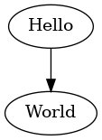

# Basic Test

**remark-unixpipe** will, for a [Code Block](https://github.com/syntax-tree/mdast#code) with the `lang` "unixpipe", pipe it's body through the command specified in it's `meta`.

## This means the following code:

    ```unixpipe env NAME="World" ./res/draw_graphviz res/hello_world.png "Hello World"
    digraph G {
      "Hello" -> "$NAME"
    }
    ```

## Results in:



## When the contents of `draw_graphviz` is:

    #!/bin/bash

    cat /dev/stdin | envsubst | dot -Tpng > "$1"
    echo ""

This documentation was generated by running `cat README.src.md | node ./test.js > README.md`

Created by @forbesmyester
License MIT
